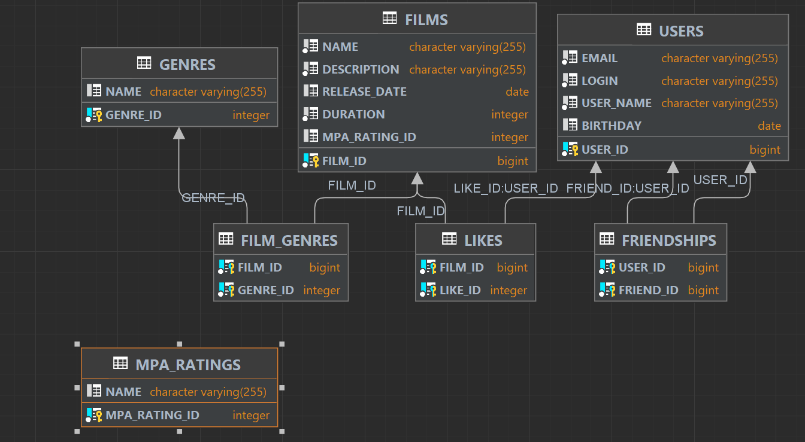

# java-filmorate
Template repository for Filmorate project.

Фильмов много — и с каждым годом становится всё больше. Чем их больше, тем больше разных оценок. Чем больше оценок, тем сложнее сделать выбор. Filmorate - это сервис, который работает с фильмами и оценками пользователей, а также возвращать топ-5 фильмов, рекомендованных к просмотру. Теперь ни вам, ни вашим друзьям не придётся долго размышлять, что посмотреть вечером.

### Используемые технологии
Java, Spring Boot, Lombok, jdbc, PostgreSQL, Maven

